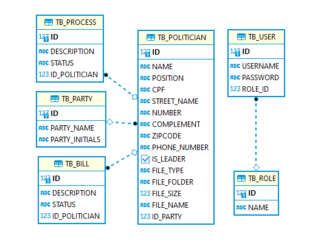

# **API Challenge**

### Introduction
This is an activity to apply the acquired  knowledge from API classes. 

### What was proposed
To develop two APIs, where:

- One is a administrator API that contains a CRUD;
- The other is a consumer API with get methods only.

### Surplus
- CPF validation;
- Create the following endpoints:

    1. List Candidates in ascending alphabetical order by name;
    2. List Candidates in descending alphabetical order by name;
    3. Get candidate by id;
    4. Filter by the number of Bills the candidate has worked on.

### Entity–relationship Diagram

### How to execute the application?

    1. Clone the project in your terminal;
    2. Execute the project in your Java IDE;
    3. Open Postman;
    4. Import the collection from the project's folder called 'postmanCollection' to Postman.

#### How to Authenticate
When starting the application, the user has to authenticate both APIs:

The Politician API(Admin) can be accessed with the following credentials:
- Manager:

    > username: Admin

    > password: Gft2021

The Consumer API can be accessed with the following credentials:
- User:

    > username: User 

    > password: Gft2021

**You can create new users to access the Consumer application**

#### Database population
The database is seeded automatically when user starts the application.

##### What is automatically in the database?
- 2 parties;
- 11 politicians;
- 11 bills, where 5 are from politician with id 10 and 4 are from politician with id 5;
- 4 law suits;

##### Tips
- When creating a new user in the Consumer API **the new password will be displayed in the console**;
- To authenticate the user to use the rest of the API: copy the token -> go to Authorization -> select type Bearer Token -> paste the token; 
- The images are saved in the project root. If you want to change the path, go to application.properties;
- The images are saved in base64, so "base64Image" option will need to receive a image string in base64;
- When saving a new image, **don't give any folder name**, the name will be given automatically.

### Requirements

- Java
- IDE or Terminal
- API plataform

### Built with
- SpringBoot: framework that facilitates the development processes;
- JPA: "...Improve the implementation of data access layers by reducing the effort to the amount that's actually needed";
- H2: SQL embedded database.
- Spring Security: "...customizable authentication and access-control framework.";
- Flyway: "Flyway is an open-source database-migration tool";
- JWT: "JSON Web Tokens are an open, industry standard RFC 7519 method for representing claims securely between two parties";
- Commons FileUpload: Package that "makes it easy to add robust, high-performance, file upload capability to your servlets and web applications";
- Log4j: "used to record all manner of activities that go on under the hood in a wide range of computer systems.";

### TODO
- Work on business rule handling.
- Code refactoring.
